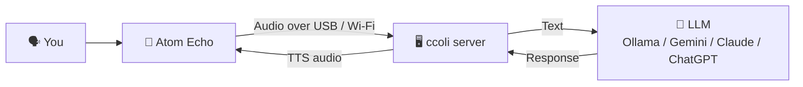

<div align="center">


# 🥦 ccoli

**Talk to your ESP32. Let your PC think.**

Voice-first AI assistant for Arduino makers — speak to an Atom Echo, get intelligent responses powered by local or cloud LLMs.

[](LICENSE)

[Quick Start](#-quick-start) · [Features](#-features) · [Docs](docs/) · [QUICKSTART.md](QUICKSTART.md)

</div>

---

## 💡 What is ccoli?

ccoli turns an **M5Stack Atom Echo (ESP32)** into a voice assistant powered by your PC. You speak → the device sends audio over USB or Wi-Fi → your PC handles speech recognition, LLM reasoning, and text-to-speech → the device plays back the response.

No cloud required. Runs with local Ollama out of the box, or connect to Gemini / Claude / ChatGPT.

<div align="center">

</div>

## ✅ What You Need

| | Component | Why |
|---|-----------|-----|
| 🖥️ | **PC** (Windows / Mac / Linux) | Runs the ccoli server (STT + LLM + TTS) |
| 🎤 | **M5Stack Atom Echo** (ESP32) | Captures your voice & plays responses |
| 🔌 | **USB-C cable** | Default wired mode, auto-detected by the server |
| 📶 | **Same Wi-Fi network** | Optional wireless mode |

## 🚀 Quick Start

### 1. Install

```bash
curl -fsSL https://raw.githubusercontent.com/surrealier/LLM_Aduino/main/scripts/install.sh | bash
```

The bootstrap script installs the lightweight CLI first, then hands off the rest to `ccoli setup`.

The setup wizard asks whether you want:
- `Ollama Local` for on-device local models
- `Cloud API` for Gemini / Claude / ChatGPT
- `Configure Later` if you only want the runtime installed first

It keeps the base install lightweight, then installs only the runtime extras this project actually uses. The default runtime no longer pulls `torch` or `transformers`.

If you want to rerun onboarding later:

```bash
ccoli setup
```

Local repo / development path:

```bash
./scripts/install.sh
# or
python3 scripts/install.py
```

### 2. Flash firmware

Open `arduino/atom_echo_m5stack_esp32_ino/atom_echo_m5stack_esp32_ino.ino` in Arduino IDE and upload to your Atom Echo.

No extra setup is required for default USB wired mode.
- If `device_secrets.h` is missing, the firmware boots in wired mode automatically
- `ccoli start` auto-detects the Atom Echo over USB serial
- Default wired serial speed is `115200` for broad CP210x stability on macOS
- Wired USB audio uses `8kHz G.711 mu-law` in both directions so mic capture and TTS both fit inside the wired bandwidth budget
- Arduino IDE upload speed can stay at `115200`; flashing speed and runtime protocol settings are still separate
- On the first connection, the server temporarily locks mic capture while the welcome TTS is sent, then the firmware reopens it after playback ends

Optional robot/display mode:
- Install Arduino libraries `Adafruit SSD1306` and `Adafruit GFX Library`
- Connect an external SSD1306 OLED to `G25` (SDA) and `G21` (SCL)

### 3. Start

```bash
ccoli start
```

Then connect the Atom Echo to your PC with USB-C.
- The server preloads STT and TTS once during startup so the first spoken turn does not pay the full model warmup cost.
- LED status: red while waiting for the server link, light green when the device is connected and ready.
- On the first healthy connection, ccoli speaks a short welcome line that picks up the recent conversation context when possible.

### 4. Optional Wi-Fi mode

```bash
ccoli config wifi MyHomeWiFi password MySecretPass port 5001
```

Then set `SERVER_IP` in `arduino/atom_echo_m5stack_esp32_ino/device_secrets.h` to your PC's local IP and upload again.

🎉 That's it — speak to the Atom Echo and hear the response!

## 🏗️ How It Works



## ✨ Features

- 🗣️ **Voice-first** — speak naturally, get voice responses
- 🧠 **Multi-LLM** — Ollama (local, default), Gemini, Claude, ChatGPT
- 🧭 **Runtime priority routing** — checks model, network, and processor candidates in order and only falls back after a higher-priority path is confirmed unavailable
- 🔌 **Integrations** — weather, calendar, search, maps, notifications
- 🎙️ **Voice ID** — speaker recognition to personalize responses
- 🤖 **Robot mode** *(coming soon)* — servo/display control via voice
- 🐳 **Docker tests** — reproducible test suite out of the box

## ⚙️ Configuration

<details>
<summary><b>LLM Provider</b></summary>

Default is Ollama (local, no API key). Switch anytime:

```bash
ccoli setup
ccoli config llm --provider ollama --model qwen3:8b
ccoli config llm --provider gemini --model gemini-1.5-flash --api-key <GEMINI_API_KEY>
ccoli config llm --provider claude --model claude-3-5-haiku-latest --api-key <ANTHROPIC_API_KEY>
ccoli config llm --provider chatgpt --model gpt-4o-mini --api-key <OPENAI_API_KEY>
```

Ollama is auto-installed and auto-started if missing.

</details>

<details>
<summary><b>Runtime Priority</b></summary>

`ccoli` now keeps runtime priority as first-class config:

```yaml
llm:
  priority: [ollama, api, ollama_cpu, other]
  api_priority: [gemini, claude, chatgpt]
connection:
  priority: [wired, wifi]
runtime:
  processor_priority: [gpu, cpu]
```

You can change the same priorities during a conversation or in the web chat:

```text
@@우선순위 상태
모델 우선순위 ollama > api > ollama cpu > other
api 우선순위 gemini > claude > chatgpt
연결 우선순위 wired > wifi
프로세서 우선순위 gpu > cpu
```

When `connection.mode` is `auto`, the server keeps checking both `Wired` and `WiFi` live and binds to the first healthy link that appears while still honoring the current priority order.

`ollama_cpu` is a distinct fallback bucket in runtime policy, but a single shared Ollama server cannot be forced to switch GPU/CPU per request. To make that bucket physically separate, point it at a dedicated CPU-only local Ollama instance.

</details>

<details>
<summary><b>Integrations</b></summary>

```bash
ccoli config integration list                          # see all integrations
ccoli config integration set weather --api-key <KEY>   # configure
ccoli config integration enable weather                # enable
ccoli config integration test weather                  # verify
```

Google Calendar example:

```bash
ccoli config integration set calendar-google \
  --client-id <ID> --client-secret <SECRET> --refresh-token <TOKEN>
ccoli config integration test calendar-google
```

Missing keys? The `test` command tells you exactly what to set.

</details>

<details>
<summary><b>Voice ID</b></summary>

```bash
ccoli config voice-id enable
ccoli config voice-id threshold --value 0.72
ccoli config voice-id status
```

Or control via voice at runtime:

```
@@<USERNAME> register voice
@@enable voice recognition
```

</details>

## 📋 CLI Reference

| Command | Description |
|---------|-------------|
| `ccoli setup` | Interactive installer / onboarding wizard |
| `ccoli start` | Start the server |
| `ccoli start --port 5002` | Start with port override |
| `ccoli config wifi <SSID> password <PASS> port <PORT>` | Configure optional Wi-Fi mode |
| `ccoli config llm --provider <name> [--model <m>] [--api-key <k>]` | Set LLM provider |
| `ccoli config integration <list\|set\|enable\|disable\|test>` | Manage integrations |
| `ccoli config voice-id <status\|enable\|disable\|delete\|threshold>` | Manage Voice ID |

## 🧪 Testing

```bash
# Docker (recommended)
docker compose -f docker/docker-compose.test.yml up --build --abort-on-container-exit --exit-code-from server-test

# or use the helper script
./scripts/run_docker_tests.sh
```

CI runs the same suite on every PR via GitHub Actions (`.github/workflows/docker-tests.yml`).

## 📁 Project Structure

```
ccoli/
├── arduino/          # Atom Echo ESP32 firmware
├── ccoli/            # CLI entry point
├── server/           # Python server (STT / LLM / TTS)
│   ├── server.py
│   ├── config.yaml
│   └── src/
├── docs/             # API, protocol, PRD docs
├── docker/           # Docker Compose for tests & mocks
└── scripts/          # Helper scripts
```

## 📖 Documentation

| Doc | What's inside |
|-----|---------------|
| [QUICKSTART.md](QUICKSTART.md) | Quick onboarding guide |
| [docs/API.md](docs/API.md) | Server module map |
| [docs/PROTOCOL.md](docs/PROTOCOL.md) | Binary protocol spec |
| [docs/PRD.md](docs/PRD.md) | Product requirements |

## 🔒 Security

- Never commit real credentials — use `device_secrets.h` only for optional Wi-Fi mode (git-ignored)
- Server secrets go in `server/.env` (see `server/env.example`)

## 📜 License

This project is licensed under the [GNU Affero General Public License v3.0](LICENSE).

## Web dashboard

Open http://localhost:8005 for the minimal green glass dashboard that surfaces status, memory, schedules, chat, integrations, and live logs.

